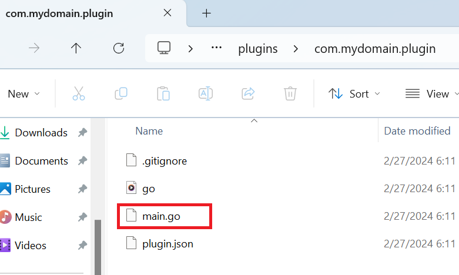

# Creating a Plugin

## Using `create-plugin` command {#create-plugin}

To create a new plugin, open a terminal and navigate inside the devkit directory.

If you are using Windows `CMD` or `PowerShell`, type:
```cmd title="PowerShell"
.\scripts\flare.bat create-plugin
```

If you are using Linux/Mac/WSL, type:
```sh title="Terminal"
./scripts/flare.sh create-plugin
```

Follow the instructions in the command prompt and enter any necessary details for your plugin. Below are the required details for your plugin:

### Package Name

This is the primary identifier for your plugin. It must be unique and follow reverse domain naming conventions, such as `com.mydomain.myplugin`. The package name should be entirely lowercase and can only include periods, underscores, or hyphens (`.` `_` `-`).

### Plugin Name

This is the official name of your plugin, for example: "System Monitor".

### Description

Please provide a concise description of your plugin. This should briefly explain its purpose.

---

## Cloning an existing plugin {#cloning-plugin}

If you need to develop an existing plugin, open a terminal and navigate to `shared/plugins/local` folder inside the devkit directory. Then clone the plugin:

```sh title="Terminal"
cd [devkit-root]/shared/plugins/local
# Replace the URL with the URL of the plugin you want to clone
git clone https://github.com/flarehotspot/com.flarego.sample
```

Now you can start developing your plugin.

---

## The main.go file

After that, your plugin will be created inside the `shared/plugins/local/[your-plugin-package]` directory (`shared/plugins/local/com.mydomain.myplugin` in this example). Inside your plugin directory, you will find a `main.go` file.



This file contains `Init` function which will be called when your plugin gets loaded into the system. Below is the initial content of `main.go` file:

```go title="main.go"

package main

import (
	"net/http"

	sdkapi "sdk/api"
)

func main() {}

func Init(api sdkapi.PluginApi) {
    // Rest of the code...
}
```

!!! note
    The `api` variable is an instance of the [IPluginApi](../api/plugin-api.md), the root API of the Flare Hotspot SDK. Throughout the documentation, when you see the variable `api`, it refers to [IPluginApi](../api/plugin-api.md).

---

## Troubleshooting

For linux users, you must change the file permissions to fix errors in your code editor:
```sh title="Terminal"
sudo chown -R $USER .
```

For MacOS users, if you encouter `Too many open files in system` error, you can fix this by cleaning the Go build cache and fixing the file permissions:

```sh title="Terminal"
go clean -cache
sudo chown -R $USER .
```
