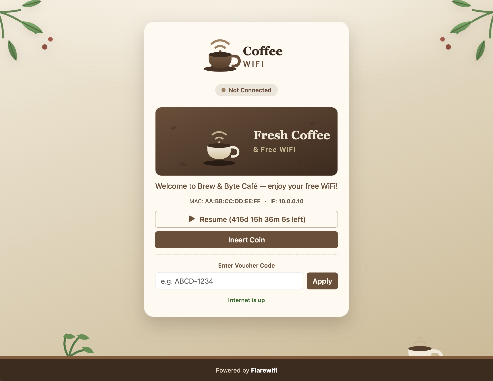

# Coffee Shop Theme

A warm khaki-and-brown captive portal theme for coffee shops, with an
admin-editable brand logo, banner image, and welcome text. It ships with tasteful
default artwork, so it looks great before you change a thing, and every branding
element can be updated from a simple settings page — no code, no reinstall.



## What it does

- **On-brand welcome** — shows your own logo, a banner image, and a friendly
  welcome message the moment guests connect to your WiFi.
- **Admin-editable branding** — the logo, banner, and welcome text are edited from
  a settings page and stored via the plugin's storage API, not hardcoded.
- **Warm coffee-house look** — a soft khaki and roasted-brown palette with green
  leaves and a wooden table, responsive down to phone screens.
- **Complete portal surface** — connection status, session/voucher actions
  (Insert Coin, Resume, Use Voucher), and the internet-status line are all themed.

## Use it as your theme template

The Coffee Shop Theme is intentionally small and self-contained — it's the best
starting point for building your own theme plugin. Rather than starting from a
blank plugin, **copy this one and rebrand it**:

1. Clone the repository:

   ```sh
   git clone https://github.com/flarewifi/com.flarego.coffee-theme
   ```

2. Copy it into your devkit's `data/plugins/devel/` directory under a new package
   name (e.g. `com.yourcompany.my-theme`), then update the `package`, `name`, and
   `description` fields in `plugin.json`.
3. Swap the artwork in `resources/assets/public/images/`, adjust the palette in the
   theme's CSS, and edit the portal `.templ` views to taste.
4. Keep the admin settings page — it's what lets non-developers rebrand the logo,
   banner, and welcome text without touching code.

Because it already wires up the full captive-portal surface (status, session and
voucher actions, admin-editable branding), you get a working, real-world theme to
learn from and reshape instead of assembling one piece by piece.

> See the [Creating a Theme](../tutorials/creating-a-theme/index.md) tutorial for a
> walkthrough of the theme plugin structure.

**Repository:** <https://github.com/flarewifi/com.flarego.coffee-theme>
