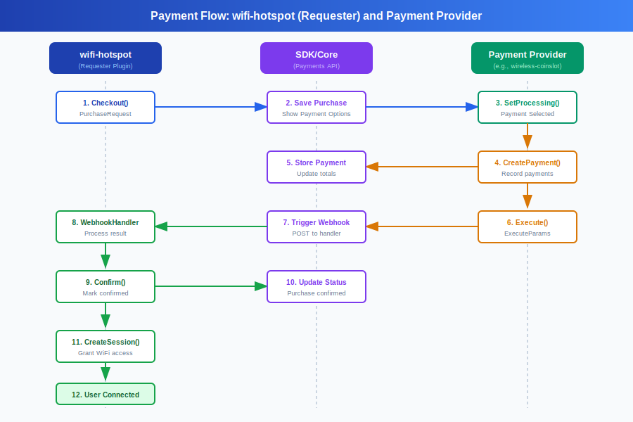

# Accept Payments

This guide explains how to implement payment processing in Flarewifi plugins. It covers both product plugins (that create purchase requests) and payment provider plugins (that process payments).

## Payment Flow Diagram

The following diagram illustrates the complete payment flow between a requester plugin (e.g., wifi-hotspot) and a payment provider (e.g., wireless-coinslot):



**Flow Steps:**

1. **Checkout** - wifi-hotspot plugin initiates purchase request
2. **Save Purchase** - Core API saves purchase and shows payment options
3. **SetProcessing** - User selects payment method, provider marks as processing
4. **CreatePayment** - Provider records payment as it's received
5. **Store Payment** - Core API updates payment totals
6. **Execute** - Provider triggers webhook with final payment details
7. **Trigger Webhook** - Core sends confirmation to product plugin
8. **WebhookHandler** - wifi-hotspot processes webhook and confirms purchase
9. **Confirm** - Purchase marked as confirmed in database
10. **Update Status** - Core API updates purchase status
11. **CreateSession** - wifi-hotspot creates session for user
12. **User Connected** - User is connected to internet

## Payment Architecture Overview

Flarewifi uses a dual-route payment architecture:

```
┌─────────────────┐         ┌──────────────────┐         ┌─────────────────┐
│  Product Plugin │         │ Payment Provider │         │  Product Plugin │
│                 │         │                  │         │                 │
│  Creates        │────────▶│  Processes       │────────▶│  Webhook        │
│  Purchase       │ Browser │  Payment         │ Server  │  Handler        │
│  Request        │ Flow    │                  │ to      │                 │
│                 │         │                  │ Server  │  - Confirms     │
│                 │         │  Calls           │         │  - Creates      │
│                 │         │  Execute()       │         │    Session      │
│                 │◀────────│                  │         │  - Connects     │
│  Callback       │ Browser │                  │         │    User         │
│  (redirect)     │ Redirect│                  │         │                 │
└─────────────────┘         └──────────────────┘         └─────────────────┘
```

### Key Components

1. **CallbackRoute** - Browser redirect after payment (user-facing, GET request)
2. **WebHookRoute** - Server-to-server POST when payment completes (JWT authenticated)
3. **Execute()** - Payment provider calls this to trigger webhook
4. **Confirm()** - Webhook handler calls this to mark purchase complete

## Creating a Product Plugin

Product plugins create purchase requests for users to buy (e.g., WiFi sessions, vouchers, downloads).

### Step 1: Create Purchase Request

```go
package portal

import (
    "net/http"
    sdkapi "sdk/api"
)

func PurchaseWifiSession(api sdkapi.IPluginApi) http.HandlerFunc {
    return func(w http.ResponseWriter, r *http.Request) {
        p := sdkapi.PurchaseRequest{
            Sku:           "wifi-connection",
            Name:          "WiFi Connection",
            Description:   "Internet access for 60 minutes",
            Price:         5.00,           // Fixed price
            AnyPrice:      false,          // Set to true for variable pricing
            CallbackRoute: "purchase.wifi.callback",  // Browser redirect
            WebHookRoute:  "purchase.wifi.webhook",   // Server webhook
            Metadata: map[string]string{
                "time_mins": "60",
                "data_mb":   "1024",
            },
        }
        api.Payments().Checkout(w, r, p)
    }
}
```

### Step 2: Create Webhook Handler

The webhook handler is **critical** - this is where you:
1. Authenticate the request
2. Parse payment details
3. **Confirm the purchase** (marks it complete in database)
4. Create the session/product for the user
5. Auto-connect the user (for WiFi sessions)

```go
package portal

import (
    "context"
    "encoding/json"
    "fmt"
    "net/http"

    "github.com/google/uuid"
    sdkapi "sdk/api"
)

func PurchaseWebhook(api sdkapi.IPluginApi) http.HandlerFunc {
    return func(w http.ResponseWriter, r *http.Request) {
        ctx := r.Context()

        // STEP 1: Extract and authenticate purchase from token query parameter
        // This single call verifies the JWT and returns the purchase
        purchase, err := api.Payments().ExtractPurchaseData(r)
        if err != nil {
            api.Logger().Error(fmt.Sprintf("Authentication failed: %v", err))
            w.WriteHeader(http.StatusUnauthorized)
            w.Write([]byte(`{"error": "Unauthorized"}`))
            return
        }

        // STEP 2: Parse execute params from request body
        var executeParams sdkapi.ExecuteParams
        if err := json.NewDecoder(r.Body).Decode(&executeParams); err != nil {
            api.Logger().Error(fmt.Sprintf("Failed to parse params: %v", err))
            w.WriteHeader(http.StatusBadRequest)
            w.Write([]byte("Invalid request body"))
            return
        }

        // Get device ID and purchase UUID from the purchase object
        deviceID := purchase.DeviceID()
        purchaseUUID := purchase.UUID()
        amount := executeParams.Amount

        api.Logger().Info(fmt.Sprintf("Webhook: device=%d, purchase=%s, amount=%.2f", 
            deviceID, purchaseUUID, amount))

        // STEP 3: Handle payment failure
        if !executeParams.Success {
            api.Logger().Error(fmt.Sprintf("Payment failed: %s", executeParams.Message))
            
            // Cancel purchase in background
            go func(p sdkapi.IPurchaseRequest) {
                p.Cancel(context.Background())
            }(purchase)
            
            w.WriteHeader(http.StatusOK)
            w.Write([]byte(executeParams.Message))
            return
        }

        // STEP 4: Get client by device ID
        clnt, err := api.SessionsMgr().FindClientById(ctx, deviceID)
        if err != nil {
            api.Logger().Error(fmt.Sprintf("Client not found: %v", err))
            w.WriteHeader(http.StatusNotFound)
            w.Write([]byte("Client not found"))
            return
        }

        // STEP 5: Confirm purchase FIRST (critical!)
        if err = purchase.Confirm(ctx); err != nil {
            api.Logger().Error(fmt.Sprintf("Failed to confirm: %v", err))
            w.WriteHeader(http.StatusInternalServerError)
            w.Write([]byte("Failed to confirm purchase"))
            return
        }

        api.Logger().Info("Purchase confirmed")

        // STEP 6: Create session/product for user
        session, err := api.SessionsMgr().CreateSession(ctx, sdkapi.CreateSessionParams{
            UUID:        uuid.New().String(), // Required - generate unique session UUID
            DevId:       clnt.ID(),
            SessionType: sdkapi.SessionTypeTime,
            TimeSecs:    3600, // 60 minutes
            DataMbytes:  1024,
            ExpDays:     nil,
            DownMbits:   10,
            UpMbits:     10,
            UseGlobal:   false,
        })
        if err != nil {
            api.Logger().Error(fmt.Sprintf("Failed to create session: %v", err))
            w.WriteHeader(http.StatusInternalServerError)
            w.Write([]byte("Failed to create session"))
            return
        }

        api.Logger().Info(fmt.Sprintf("Created session ID: %d", session.ID()))

        // STEP 7: Link session to purchase (optional but recommended)
        // This helps track which purchase created which session
        // Implement your own session-purchase linking logic here

        // STEP 8: Auto-connect user to internet
        if !api.SessionsMgr().IsConnected(clnt) {
            successMsg := "Payment successful! Connecting to internet..."
            err = api.SessionsMgr().Connect(ctx, clnt, successMsg)
            if err != nil {
                api.Logger().Error(fmt.Sprintf("Auto-connect failed: %v", err))
                w.WriteHeader(http.StatusInternalServerError)
                w.Write([]byte("Session created but connection failed"))
                return
            }
            api.Logger().Info(fmt.Sprintf("Device %d connected", deviceID))
        }

        // STEP 9: Return success
        w.WriteHeader(http.StatusOK)
        w.Write([]byte("Session created and device connected"))
    }
}
```

### Step 3: Create Callback Handler (Optional)

The callback handler is for browser redirects after payment. This is optional - you can redirect directly to the portal.

```go
func PurchaseCallback(api sdkapi.IPluginApi) http.HandlerFunc {
    return func(w http.ResponseWriter, r *http.Request) {
        res := api.Http().Response()
        
        // Show success page or redirect to portal
        res.FlashMsg(w, r, api.Translate("success", "Payment successful!"), sdkapi.FlashMsgSuccess)
        http.Redirect(w, r, "/", http.StatusSeeOther)
    }
}
```

### Step 4: Register Routes

```go
package routes

import (
    sdkapi "sdk/api"
    controllers "yourplugin/app/controllers/portal"
)

func PortalRoutes(api sdkapi.IPluginApi) {
    router := api.Http().Router().PluginRouter()

    router.Group("/purchase", func(subrouter sdkapi.IHttpRouterInstance) {
        subrouter.Get("/wifi", controllers.PurchaseWifiSession(api)).Name("purchase.wifi")
        subrouter.Get("/callback", controllers.PurchaseCallback(api)).Name("purchase.wifi.callback")
        subrouter.Post("/webhook", controllers.PurchaseWebhook(api)).Name("purchase.wifi.webhook")
    })
}
```

## Creating a Payment Provider Plugin

Payment provider plugins process payments (e.g., wireless-coinslot, PayStack, Stripe).

### Step 1: Implement Payment Provider Interface

```go
package src

import (
    "net/http"
    sdkapi "sdk/api"
)

type MyPaymentProvider struct {
    name string
    api  sdkapi.IPluginApi
}

func NewPaymentProvider(api sdkapi.IPluginApi) *MyPaymentProvider {
    return &MyPaymentProvider{
        name: api.Translate("label", "My Payment Method"),
        api:  api,
    }
}

// Name returns the display name of the payment provider
func (self *MyPaymentProvider) Name() string {
    return self.name
}

// OptionsFactory returns available payment options
func (self *MyPaymentProvider) OptionsFactory(r *http.Request) []sdkapi.PaymentOption {
    // Return list of payment options (e.g., different coinslots, bank accounts, etc.)
    // IMPORTANT: UUID should be a stable, reproducible identifier based on device MAC address
    return []sdkapi.PaymentOption{
        {
            UUID:        generatePaymentOptionUUID("AA:BB:CC:DD:EE:FF"), // 16-char hash of MAC
            Name:        "Main Entrance Coinslot",
            RouteName:   "payments.coinslot",
            RouteParams: map[string]string{"id": "coinslot-1"},
        },
    }
}

// generatePaymentOptionUUID creates a stable UUID based on MAC address
func generatePaymentOptionUUID(macAddress string) string {
    normalized := strings.ToUpper(strings.ReplaceAll(macAddress, ":", ""))
    seed := "your-plugin-name:" + normalized
    fullHash := sdkutils.Sha1Hash(seed)
    return fullHash[:16] // Truncate to 16 characters
}
```

### Step 2: Create Payment Handler

This handler collects payment from the user and calls `purchase.Execute()`.

```go
func ProcessPayment(api sdkapi.IPluginApi) http.HandlerFunc {
    return func(w http.ResponseWriter, r *http.Request) {
        res := api.Http().Response()
        ctx := r.Context()

        // Get the purchase request
        purchase, err := api.Payments().GetPurchaseRequest(r)
        if err != nil {
            res.Error(w, r, err, 500)
            return
        }

        // Get client device
        clnt, err := api.Http().GetClientDevice(r)
        if err != nil {
            res.Error(w, r, err, 500)
            return
        }

        // ... collect payment from user (coins, API call, etc.) ...
        amountPaid := 31.00 // Example amount

        // Execute the purchase (triggers webhook)
        err = purchase.Execute(ctx, sdkapi.ExecuteParams{
            DeviceID:    clnt.ID(),
            PurchaseUID: purchase.UUID(), // Use UUID() not ID() - must be string UUID!
            Amount:      amountPaid,
            Success:     true,
            Message:     "Payment successful",
        })
        if err != nil {
            api.Logger().Error(fmt.Sprintf("Failed to execute: %v", err))
            res.Error(w, r, err, 500)
            return
        }

        // Respond to user
        res.Json(w, r, map[string]interface{}{
            "success": true,
            "message": "Payment processed",
        }, 200)
    }
}
```

### Step 3: Register Payment Provider

In your plugin's initialization:

```go
func init(api sdkapi.IPluginApi) {
    // Register payment provider
    provider := NewPaymentProvider(api)
    api.Payments().RegisterProvider(provider)
    
    // Set up routes
    SetRoutes(api)
}
```

## Important Concepts

### CallbackRoute vs WebHookRoute

| Aspect | CallbackRoute | WebHookRoute |
|--------|--------------|--------------|
| **Purpose** | Browser redirect after payment | Server-to-server notification |
| **Method** | GET | POST |
| **Authentication** | JWT token in query param `?token=<jwt>` | JWT token in query param `?token=<jwt>` |
| **Triggers** | User clicks "back to site" | Payment provider calls Execute() |
| **Use case** | Show success page, redirect | Confirm purchase, create session |
| **Required** | Optional | **Required** |

### Payment Flow Sequence

1. **User initiates purchase** → Product plugin creates PurchaseRequest
2. **User selects payment method** → Payment system shows available providers
3. **User makes payment** → Payment provider collects payment
4. **Provider calls Execute()** → Triggers internal webhook POST to WebHookRoute
5. **Webhook handler authenticates** → Verifies JWT token
6. **Webhook confirms purchase** → Calls purchase.Confirm(ctx)
7. **Webhook creates session** → User gets their product/service
8. **Webhook auto-connects user** → User gets internet access
9. **Execute() returns success** → Payment provider shows success to user
10. **Browser redirects** → User returns to CallbackRoute (optional)

### Critical Implementation Details

#### 1. Confirm Purchase BEFORE Creating Session

```go
// CORRECT ORDER
if err = purchase.Confirm(ctx); err != nil {
    return
}
session, err := api.SessionsMgr().CreateSession(ctx, ...)

// WRONG ORDER - purchase stays in "processing" state
session, err := api.SessionsMgr().CreateSession(ctx, ...)
if err = purchase.Confirm(ctx); err != nil {
    return
}
```

If you create the session first and then Confirm() fails, the user gets a session but the purchase remains incomplete.

#### 2. Handle Payment Failures

```go
if !executeParams.Success {
    // Always acknowledge receipt
    w.WriteHeader(http.StatusOK)
    
    // Cancel purchase in background (purchase is already available from ExtractWebhookData)
    go func(p sdkapi.IPurchaseRequest) {
        p.Cancel(context.Background())
    }(purchase)
    return
}
```

#### 3. Check Execute() Return Value

```go
// CORRECT - check for errors
err = purchase.Execute(ctx, params)
if err != nil {
    api.Logger().Error(fmt.Sprintf("Execute failed: %v", err))
    // Handle error
    return
}

// WRONG - silently ignores errors
purchase.Execute(ctx, params)
// No error checking - webhook might have failed!
```

#### 4. Use Context Properly

```go
// Get context from request
ctx := r.Context()

// Pass to all operations
purchase.Confirm(ctx)
api.SessionsMgr().CreateSession(ctx, ...)
api.SessionsMgr().Connect(ctx, clnt, msg)
```

Context ensures proper timeout handling and cancellation propagation.

#### 5. Always Generate Session UUID

```go
import "github.com/google/uuid"

// CORRECT - provide UUID
session, err := api.SessionsMgr().CreateSession(ctx, sdkapi.CreateSessionParams{
    UUID:        uuid.New().String(), // Required!
    DevId:       clnt.ID(),
    SessionType: sdkapi.SessionTypeTime,
    TimeSecs:    3600,
    DataMbytes:  1024,
    ExpDays:     nil,
    DownMbits:   10,
    UpMbits:     10,
    UseGlobal:   false,
})

// WRONG - missing UUID causes "session UUID is required" error
session, err := api.SessionsMgr().CreateSession(ctx, sdkapi.CreateSessionParams{
    DevId:       clnt.ID(), // Missing UUID!
    SessionType: sdkapi.SessionTypeTime,
    // ...
})
```

Without a UUID, CreateSession will return an error: "session UUID is required".

#### 6. Use purchase.UUID() Not purchase.ID()

```go
// CORRECT - passes UUID string like "b1ec7c05-3d51-4a7c-af92-f88ff13bdd38"
err = purchase.Execute(ctx, sdkapi.ExecuteParams{
    DeviceID:    clnt.ID(),
    PurchaseUID: purchase.UUID(), // Correct - string UUID!
    Amount:      amountPaid,
    Success:     true,
    Message:     "Payment successful",
})

// WRONG - passes numeric ID like "1" which won't be found in database
err = purchase.Execute(ctx, sdkapi.ExecuteParams{
    DeviceID:    clnt.ID(),
    PurchaseUID: fmt.Sprintf("%v", purchase.ID()), // Wrong - numeric ID!
    Amount:      amountPaid,
    Success:     true,
    Message:     "Payment successful",
})
```

The webhook handler uses `FindPurchaseRequestByUUID()` which expects a UUID string, not a numeric ID.

## Common Patterns

### Variable Pricing (AnyPrice)

For products where users can pay any amount:

```go
p := sdkapi.PurchaseRequest{
    Sku:           "wifi-donation",
    Name:          "WiFi Access",
    Description:   "Pay what you want",
    AnyPrice:      true,  // Allow any amount
    Price:         0,     // Ignored when AnyPrice is true
    CallbackRoute: "purchase.wifi.callback",
    WebHookRoute:  "purchase.wifi.webhook",
}
```

In your webhook handler, calculate session time based on amount paid:

```go
amount := executeParams.Amount
sessionSeconds := calculateSessionTime(amount, rateConfig)
```

### Fixed Pricing

For products with a set price:

```go
p := sdkapi.PurchaseRequest{
    Sku:           "wifi-1hour",
    Name:          "WiFi 1 Hour",
    Description:   "Internet access for 60 minutes",
    AnyPrice:      false,  // Fixed price only
    Price:         5.00,   // Exact price required
    CallbackRoute: "purchase.wifi.callback",
    WebHookRoute:  "purchase.wifi.webhook",
}
```

Payment providers should enforce the exact price.

### Storing Custom Data

Use the Metadata field to store custom information:

```go
p := sdkapi.PurchaseRequest{
    Sku:           "wifi-session",
    Name:          "WiFi Session",
    Description:   "Internet access",
    Price:         10.00,
    AnyPrice:      false,
    CallbackRoute: "purchase.wifi.callback",
    WebHookRoute:  "purchase.wifi.webhook",
    Metadata: map[string]string{
        "time_mins":  "120",
        "data_mb":    "2048",
        "rate_index": "2",
        "promo_code": "SUMMER2024",
    },
}
```

Retrieve in webhook handler:

```go
metadata := purchase.Metadata()
timeMins := metadata["time_mins"]
dataMb := metadata["data_mb"]
```

## Testing Your Implementation

### 1. Test Webhook Authentication

Try calling your webhook without JWT token - should get 401:

```bash
curl -X POST http://localhost:3000/p/yourplugin/0.0.1/purchase/webhook \
  -H "Content-Type: application/json" \
  -d '{"device_id": 1, "purchase_uid": "test", "amount": 10.0, "success": true}'
```

Expected: `401 Unauthorized`

### 2. Test Payment Flow

Enable debug logging and watch the complete flow:

```bash
docker logs flarewifi-app-1 -f 2>&1 | grep -E "(Webhook|Execute|Confirm)"
```

Expected log sequence:
```
[Provider] Executing purchase (ID: X) with amount 10.00
Webhook request created with JWT token
[Product] PurchaseWebhook: Started processing webhook
[Product] PurchaseWebhook: Purchase confirmed
[Product] PurchaseWebhook: Created session with ID: X
[Product] PurchaseWebhook: Device connected
Webhook executed successfully
[Provider] Purchase executed successfully
```

### 3. Verify Purchase Completion

After payment, check that:
- Purchase status is "confirmed" in database
- User has an active session
- User is connected to internet
- Purchase no longer appears in portal

## Troubleshooting

### Purchase Stays in "Processing" State

**Cause:** Webhook handler didn't call `purchase.Confirm(ctx)`

**Fix:** Ensure your webhook handler calls Confirm() before returning success:

```go
if err = purchase.Confirm(ctx); err != nil {
    w.WriteHeader(http.StatusInternalServerError)
    return
}
```

### "WebHookRoute is not configured"

**Cause:** PurchaseRequest doesn't have WebHookRoute set

**Fix:** Add WebHookRoute when creating purchase:

```go
p := sdkapi.PurchaseRequest{
    // ...
    WebHookRoute: "purchase.wifi.webhook",  // Add this!
}
```

### Execute() Returns Error

**Cause:** Multiple possible issues:
- Webhook route doesn't exist
- Webhook handler crashed
- Webhook returned non-200 status

**Fix:** Check logs for webhook execution:

```bash
docker logs flarewifi-app-1 -f 2>&1 | grep Webhook
```

### User Not Auto-Connected

**Cause:** Forgot to call `api.SessionsMgr().Connect()`

**Fix:** Add connect call at end of webhook handler:

```go
if !api.SessionsMgr().IsConnected(clnt) {
    err = api.SessionsMgr().Connect(ctx, clnt, "Payment successful!")
}
```

### "Session UUID is required"

**Cause:** CreateSession called without UUID parameter

**Fix:** Generate a UUID when creating sessions:

```go
import "github.com/google/uuid"

session, err := api.SessionsMgr().CreateSession(ctx, sdkapi.CreateSessionParams{
    UUID:        uuid.New().String(), // Required!
    DevId:       clnt.ID(),
    SessionType: sdkapi.SessionTypeTime,
    TimeSecs:    3600,
    DataMbytes:  1024,
    ExpDays:     nil,
    DownMbits:   10,
    UpMbits:     10,
    UseGlobal:   false,
})
```

The `UUID` field is required for all sessions. Use `github.com/google/uuid` package to generate unique UUIDs.

### "Purchase not found" in Webhook Handler

**Cause:** Payment provider passing `purchase.ID()` (numeric) instead of `purchase.UUID()` (string)

**Fix:** Always use UUID (string) not ID (int64) in ExecuteParams:

```go
// WRONG - passes numeric ID "1" which won't be found
err = purchase.Execute(ctx, sdkapi.ExecuteParams{
    DeviceID:    clnt.ID(),
    PurchaseUID: fmt.Sprintf("%v", purchase.ID()), // Wrong!
    Amount:      amountPaid,
    Success:     true,
    Message:     "Payment successful",
})

// CORRECT - passes UUID string "b1ec7c05-3d51-4a7c-af92-f88ff13bdd38"
err = purchase.Execute(ctx, sdkapi.ExecuteParams{
    DeviceID:    clnt.ID(),
    PurchaseUID: purchase.UUID(), // Correct!
    Amount:      amountPaid,
    Success:     true,
    Message:     "Payment successful",
})
```

**Error in logs:**
```
ERROR PurchaseWebhook: FindPurchaseRequestByUUID error: sql: no rows in result set
```

This happens because the webhook handler calls `FindPurchaseRequestByUUID()` which expects a UUID string like `"b1ec7c05-3d51-4a7c-af92-f88ff13bdd38"`, not a numeric ID like `"1"`.

## Reference Implementation

See these plugins for complete working examples:

- **Product Plugin:** `com.spaceai.wifi-hotspot` - Full webhook implementation with JWT auth
- **Payment Provider:** `com.flarego.wireless-coinslot` - ESP8266-based coin payment system
- **Alternative:** `com.flarego.wifi-hotspot` - Simplified wifi session purchases

## API Reference

### PurchaseRequest Struct

```go
type PurchaseRequest struct {
    Sku           string            // Unique identifier for this product type
    Name          string            // Display name
    Description   string            // Short description
    Price         float64           // Price (ignored if AnyPrice is true)
    AnyPrice      bool              // Allow variable pricing
    CallbackRoute string            // Browser redirect route (optional)
    WebHookRoute  string            // Server webhook route (required)
    Metadata      map[string]string // Custom data
}
```

### ExecuteParams Struct

```go
type ExecuteParams struct {
    DeviceID    int64   // Client device ID
    PurchaseUID string  // Purchase UUID
    Amount      float64 // Amount paid
    Success     bool    // Payment success status
    Message     string  // Status message
}
```

### IPurchaseRequest Interface

Key methods:

```go
// Get purchase details
ID() int64
UUID() string
Price() float64
AnyPrice() bool
Metadata() map[string]string

// Execute webhook (payment provider calls this)
Execute(ctx context.Context, params ExecuteParams) error

// Confirm purchase (webhook handler calls this)
Confirm(ctx context.Context) error

// Cancel purchase
Cancel(ctx context.Context) error

// Check status
IsConfirmed() bool
IsCancelled() bool
Processing() bool
```

## Best Practices

1. **Always separate CallbackRoute and WebHookRoute** - Don't use the same route for both
2. **Use ExtractPurchaseData for authentication** - Single method handles JWT verification for both callbacks and webhooks
3. **Confirm purchases before creating sessions** - Ensures data consistency
4. **Handle payment failures gracefully** - Cancel purchases, show user-friendly errors
5. **Log everything** - Makes debugging much easier
6. **Test with debug logging enabled** - Verify the complete flow works
7. **Check Execute() return values** - Don't ignore errors
8. **Auto-connect users** - Better user experience
9. **Use transactions where appropriate** - Ensures atomicity
10. **Document your metadata fields** - Future developers will thank you
11. **Always generate UUID for sessions** - CreateSession requires `uuid.New().String()`
12. **Use purchase.UUID() not purchase.ID()** - ExecuteParams expects UUID string, not numeric ID

## Summary

Payment processing in Flarewifi uses a webhook pattern:

1. **Product plugins** create PurchaseRequests with CallbackRoute + WebHookRoute
2. **Payment providers** collect payment and call Execute()
3. **Execute()** triggers internal POST to WebHookRoute with JWT auth
4. **Webhook handler** confirms purchase, creates session, connects user
5. **Browser** optionally redirects to CallbackRoute

The key to success is implementing a proper webhook handler that:
- Extracts and authenticates purchase using ExtractPurchaseData()
- Confirms the purchase
- Creates the session/product
- Auto-connects the user
- Returns appropriate HTTP status codes
